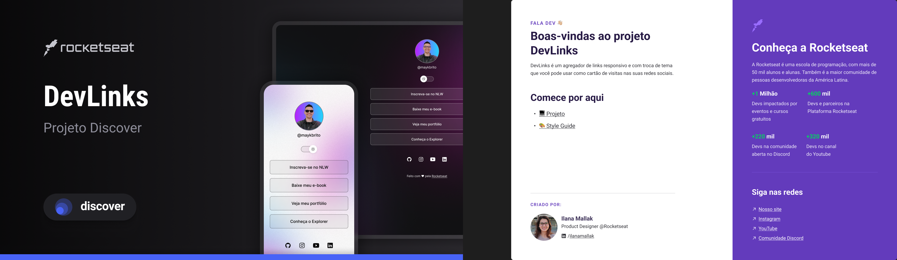

<h1 align="center"> DevLinks </h1>

<a href="https://lp.rocketseat.com.br/devlinks/inscricao?utm_source=github&utm_medium=descricao&utm_campaign=capture-devlinks&utm_term=organic&utm_content=descricao-github-mayk-brito">
 Study this project in video by clicking here</a>

  <a href="#-tecnologias">Technologies</a>&nbsp;&nbsp;&nbsp;|&nbsp;&nbsp;&nbsp;
  <a href="#-projeto">Project</a>&nbsp;&nbsp;&nbsp;|&nbsp;&nbsp;&nbsp;
  <a href="#-layout">Layout</a>&nbsp;&nbsp;&nbsp;|&nbsp;&nbsp;&nbsp;
  <a href="#memo-licença">License</a>

  

 

  

## 🚀 Technologies

This project was developed using the following technologies:
- HTML e CSS
- JavaScript
- Git e Github
- Figma

## 💻 Project

The DevLinks is a link aggregator to use as an online business card.

- [View the final project online](https://cristiangiehl1.github.io/Projeto-DevLinks/)

- [Watch classes](https://lp.rocketseat.com.br/devlinks/inscricao?utm_source=github&utm_medium=descricao&utm_campaign=capture-devlinks&utm_term=organic&utm_content=descricao-github-mayk-brito)

## 🔖 Layout

You can preview the project layout through [DESSE LINK](https://www.figma.com/community/file/1187422022288947321). It's necessary to have an account on [Figma](https://figma.com) to access it.

## :memo: License

This project is licensed under the MIT License.

---

Made with ♥ by Rocketseat :wave: [Join our community!](https://discord.gg/rocketseat)
